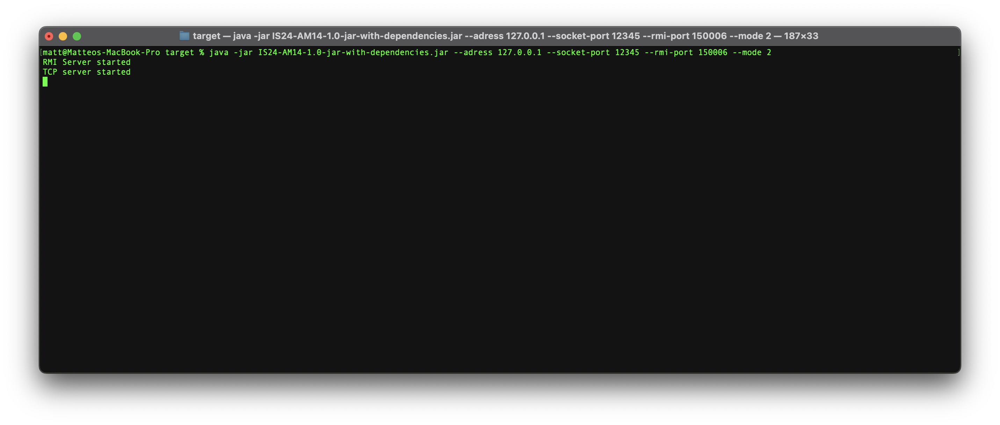
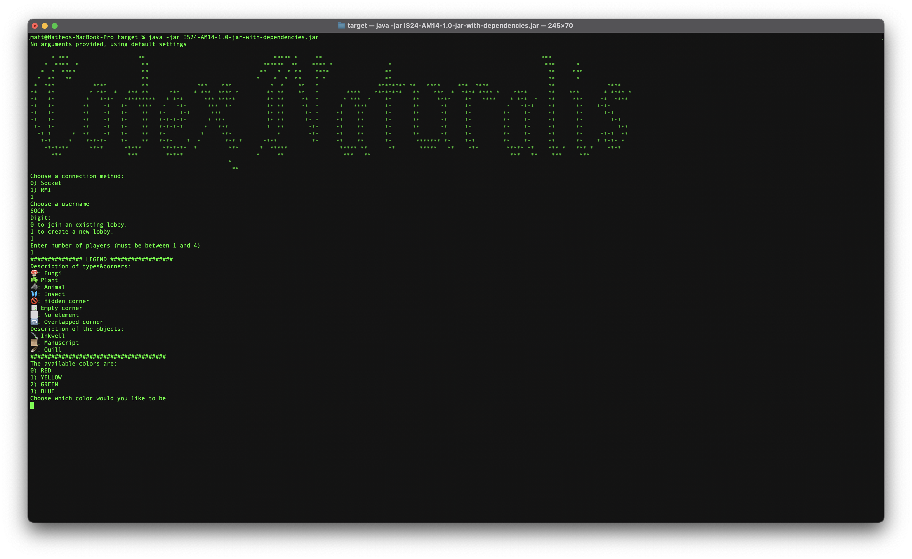
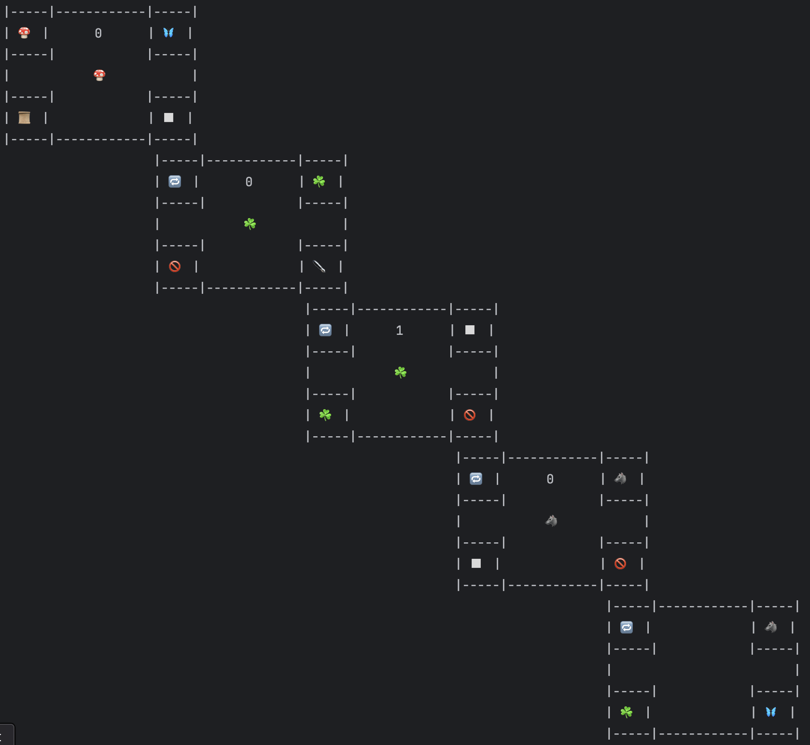

# CODEX - IS24AM14


## The project
This Java project is a porting of the boardgame *CODEX* by [Cranio Creations](https://www.craniocreations.it/prodotto/codex-naturalis). It is being realized as final project of the *Software Engineering* course at [Politecnico di Milano](https://www.polimi.it). 

### The team
**Group 14 (Prof. Alessandro Margara)**
- Matteo Delogu ([@Orbital01](https://github.com/Orbital01))
- Vittorio Remigio Pio Cozzoli ([@justvicthor](https://github.com/justvicthor))
- Stefan Bogdanovic ([@SteBog](https://github.com/SteBog))
- Niccolò Francesco Basile ([@BasicNickPolimi](https://github.com/BasicNickPolimi))

---

## Status of the work
| Functionality | Status | 
| --- | --- |
| Basic rules | :white_check_mark: |
| Complete rules | :white_check_mark: |
| Socket connection | :white_check_mark: |
| RMI connection | :white_check_mark: |
| CLI | :white_check_mark: |
| GUI | :white_check_mark: |
| Multiple games | :white_check_mark:|
| Persistence | :x: |
| Resilience | :x: |
| Chat | :white_check_mark: |

**Legend**
| Symbol | Functionality status |
| --- | --- |
| :white_check_mark: | Completed |
| :ballot_box_with_check: | Planned, not started yet | 
| :construction: | Work in progress |
| :x: | Not planned to be implemented |

---

## How to play
### Requirements
- Java 21.0.0
- it is recommended to use a unicode-compatible terminal

### Run the game
1. Clone the repository
2. Open a terminal and navigate to the folder 
3. Build the project with the following command:
    ```shell
    mvn clean package
    ```
    This will create a `.jar` file in the `target` folder


3. You can run the app with the following command:
    ```shell
    java -jar IS24-AM14-1.0-jar-with-dependencies.jar
    ```
   it will have the following **_default_** parameters:
    * `CLI` user interface
    * LoopBack IP address 🔁
    * 12345 socket port
    * 12346 RMI port
   

4. If you want to change the parameters, you can use the following options as **arguments**:
    * `--address xxx.xxx.xxx.xxx`
      * where `xxx.xxx.xxx.xxx` is the IP address of the server
    * `--socket-port xxxxx`
      * where `xxxxx` is the port of the server
    * `--rmi-port xxxxx`
      * where `xxxxx` is the port of the server
    * `--mode`
      * 0 for **CLI**
      * 1 for **GUI**
      * 2 for **Server**

### Example

-> starting the client
```shell
java -jar IS24-AM14-1.0-jar-with-dependencies.jar --address 192.168.0.1 --socket-port 12345 --rmi-port 12346 --mode 1
```
-> starting the server
```shell
java -jar IS24-AM14-1.0-jar-with-dependencies.jar --address 192.168.0.1 --socket-port 12345 --rmi-port 12346 --mode 2
```

> :warning: **Note**: The server must be launched in order to play the game

> :warning: **Note**: Both socket and RMI ports must be set to the same value on the server and the client

> :warning: **Note**: If there's only one input missing, the default value will be used for the missing one

> :warning: **Note**: If the address is invalid, the default value will be used 🔁


## In Game Screenshots





## Legal

Codex è un gioco da tavolo sviluppato ed edito da Cranio Creations Srl. I contenuti grafici di questo progetto riconducibili al prodotto editoriale da tavolo sono utilizzati previa approvazione di Cranio Creations Srl a solo scopo didattico. È vietata la distribuzione, la copia o la riproduzione dei contenuti e immagini in qualsiasi forma al di fuori del progetto, così come la redistribuzione e la pubblicazione dei contenuti e immagini a fini diversi da quello sopracitato. È inoltre vietato l'utilizzo commerciale di suddetti contenuti.

