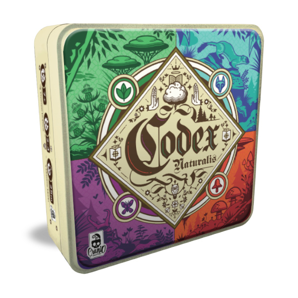

# CODEX - IS24AM14

## The project
This Java project is a porting of the boardgame *CODEX* by [Cranio Creations](https://www.craniocreations.it/prodotto/codex-naturalis). It is being realized as final project of the *Software Engineering* course at [Politecnico di Milano](https://www.polimi.it). 

### The team
**Group 14 (Prof. Alessandro Margara)**
- Matteo Delogu ([@Orbital01](https://github.com/Orbital01))
- Vittorio Remigio Pio Cozzoli ([@justvicthor](https://github.com/justvicthor))
- Stefan Bogdanovic ([@SteBog](https://github.com/SteBog))
- Niccolò Francesco Basile ([BasicNickPolimi](https://github.com/BasicNickPolimi))

---

## Status of the work
| Functionality | Status | 
| --- | --- |
| Basic rules | Completed |
| Complete rules | :construction: |
| Socket connection | :construction: |
| RMI connection | :construction: |
| CLI | :ballot_box_with_check: |
| GUI | :ballot_box_with_check: |
| Multiple games | :construction:|
| Persistence | :x: |
| Resilience | :x: |
| Chat | :ballot_box_with_check: |

**Legend**
| Symbol | Functionality status |
| --- | --- |
| :white_check_mark: | Completed |
| :ballot_box_with_check: | Planned, not started yet | 
| :construction: | Work in progress |
| :x: | Not planned to be implemented |

---

## Legal

Codex è un gioco da tavolo sviluppato ed edito da Cranio Creations Srl. I contenuti grafici di questo progetto riconducibili al prodotto editoriale da tavolo sono utilizzati previa approvazione di Cranio Creations Srl a solo scopo didattico. È vietata la distribuzione, la copia o la riproduzione dei contenuti e immagini in qualsiasi forma al di fuori del progetto, così come la redistribuzione e la pubblicazione dei contenuti e immagini a fini diversi da quello sopracitato. È inoltre vietato l'utilizzo commerciale di suddetti contenuti.

